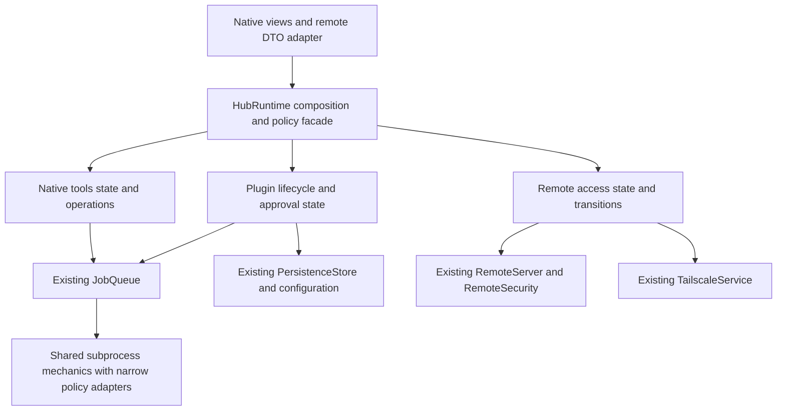

# KiwiOS codebase audit — 2026-09-12

Implementation follow-up: [remediation record](2026-09-12-remediation.md). This audit below preserves the original findings and source locations.

The main implementation exists, but lifecycle and persistence boundaries need another pass before feature expansion. The highest-priority problems are a native form crash, mode changes racing job admission, incomplete disablement when persistence fails, and uninstall behavior that can leave inconsistent records or retained credentials. Cleanup should concentrate on shared process mechanics, state ownership, and duplicate presentation—not weaken approval, redaction, or protocol checks.

This report contains **27 ranked findings: 5 P1, 13 P2, and 9 P3**, followed by architecture recommendations, concrete deletion candidates, and deferred validation. Priorities are review judgments: P1 should be addressed before expanding the platform; P2 affects normal recovery, correctness, or bounded operation; P3 is a smaller inconsistency or a policy decision. None is a claim of a reproduced exploit.

## Scope and method

- Reviewed the current uncommitted working tree, including **27 application Swift files / 8,957 lines**, the PWA, **4 test-source files / 1,237 lines**, bundled plugins, the author template, catalog, project definition, CI, and relevant contracts.
- Installed and verified **Ponytail 4.9.0**, `ponytail@ponytail`, as installed/enabled through the local Codex CLI before delegating the audit. Applied its audit/review skills directly in this session. Automatic lifecycle-hook activation was not verified; upstream separately documents hook trust and a new thread/app reload in its [Codex setup instructions](https://github.com/DietrichGebert/ponytail#codex).
- Used three **GPT Sol medium** subagents for runtime/persistence, remote/PWA, and plugin installation/contracts. The primary agent reviewed native/UI/composition and reconciled findings; an additional pass independently checked the native findings.
- Ponytail's complexity review and the broader correctness review are separate. Necessary safety checks are not counted as bloat. Proposed line reductions are estimates, not measured patches.
- **No application builds, tests, plugin scripts, SSH probes, Homebrew work, listeners, or live Tailscale changes were run.** Evidence is source tracing, callsite searches, existing test inspection, and the OpenSSH primary reference noted below.
- Application code was not changed for this audit. This report is the repository deliverable. Existing implementation changes remain uncommitted.
- Locations refer to this working-tree snapshot. Repository paths are relative; line ranges are stated explicitly.

## Coverage map

| Area | Reviewed boundary | Main result |
|---|---|---|
| Runtime and jobs | Startup, mode changes, enable/disable, queue admission, schedules, cancellation, shutdown | Transition ownership and failure cleanup need tightening |
| Persistence and secrets | SQLite transactions, config materialization, Keychain, install/remove ordering | Multi-store operations can partially commit |
| Plugin loading/install | Manifest/schema validation, fingerprints, exact SHA, Git export, dependency graph, catalog | Strong input checks; recovery and failure isolation need work |
| Remote transport | Loopback binding, Serve ownership, sessions, origin/CSRF/replay, request budgets | Core gates exist; partial publication and lifetime semantics need fixes |
| Native services | Processes, LaunchAgents, Homebrew, SSH, notifications, host snapshots | Stale state and aggregate timing gaps; ambient SSH policy needs a decision |
| UI/PWA | Forms, jobs, navigation, live data, offline behavior, source review | Duplicate/full-form caches create lost-update risks; renderer parity is incomplete |
| Delivery/contracts | Project resources, dependencies, CI, examples, roadmap, test sources | Source presence is well documented; operational claims still require validation |

## Priority inventory

| ID | Priority | Finding | Primary location |
|---|---|---|---|
| R01 | P1 | Accepted integer config can crash a native form | `KiwiOS/PluginContentView.swift:395` |
| R02 | P1 | Remote mode transition races job admission | `KiwiOS/HubRuntime.swift:606–621` |
| R03 | P1 | Failed disable persistence skips cancellation | `KiwiOS/HubRuntime.swift:316–333` |
| R04 | P1 | Uninstall deletes files before committing removal | `KiwiOS/HubIntegrations.swift:209–233` |
| R05 | P1 | Delete-data uninstall retains write-only secrets | `KiwiOS/HubIntegrations.swift:209–233` |
| R06 | P2 | Failed update activation disrupts the old revision | `KiwiOS/HubIntegrations.swift:179–203` |
| R07 | P2 | One invalid plugin aborts all plugin discovery | `KiwiOS/PluginDiscovery.swift:28–69` |
| R08 | P2 | Config saves can partially commit and lose concurrent edits | `KiwiOS/PluginConfiguration.swift:19–45` |
| R09 | P2 | Duplicate/stale forms overwrite newer public values | `KiwiOS/RootView.swift:339–346` |
| R10 | P2 | Partial Serve publication loses ownership knowledge | `KiwiOS/TailscaleService.swift:110–118` |
| R11 | P2 | Shutdown can be followed by new startup polling tasks | `KiwiOS/HubRuntime.swift:126–134,678–688` |
| R12 | P2 | Re-enabling a dependency leaves dependents blocked | `KiwiOS/HubRuntime.swift:278–307,325–333` |
| R13 | P2 | File log retention is constrained by the smaller result capture | `KiwiOS/Runtime.swift:320–328` |
| R14 | P2 | Native operation completion leaves Tools stale | `KiwiOS/HubIntegrations.swift:107–116` |
| R15 | P2 | Tools waits for up to 50 sequential launchctl probes | `KiwiOS/NativeCapabilities.swift:372–388` |
| R16 | P2 | Installed revisions and orphan snapshots accumulate | `KiwiOS/PluginInstaller.swift:261–288` |
| R17 | P2 | HTTP timeout helper is not a hard request deadline | `KiwiOS/RemoteServer.swift:269–281` |
| R18 | P2 | Installing Tailscale after launch is not detected | `KiwiOS/TailscaleService.swift:58–64` |
| R19 | P3 | Server session expiry slides beyond its original lifetime | `KiwiOS/RemoteSecurity.swift:97–107,123–140` |
| R20 | P3 | Required PWA enums acquire an implicit first-choice default | `KiwiOS/Web/app.js:31–58` |
| R21 | P3 | PWA Jobs omits retained progress steps | `KiwiOS/Web/app.js:112–120` |
| R22 | P3 | Mutation fields are validated against a union, not their operation | `KiwiOS/RemoteServer.swift:263–267` |
| R23 | P3 | Session exhaustion is not a one-minute rate-limit condition | `KiwiOS/RemoteSecurity.swift:86–94` |
| R24 | P3 | Path/catalog validation rules drift between surfaces | `KiwiOS/PluginConfigSchema.swift:185–189` |
| R25 | P3 | SSH probe behavior includes ambient SSH configuration | `KiwiOS/NativeCapabilities.swift:295–307` |
| R26 | P3 | Plugin summary restoration depends on global history recency | `KiwiOS/HubRuntime.swift:535–567` |
| R27 | P3 | Queue shutdown does not drain suspended admission writes | `KiwiOS/JobQueue.swift:195–238,355–382` |

## P1 findings

### R01 — Accepted integer configuration can crash the native control plane

**Evidence:** `PluginConfigSchema.matches` accepts any finite integral Double (`KiwiOS/PluginConfigSchema.swift:176–180`). Native form loading narrows it with `String(Int(number))` (`KiwiOS/PluginContentView.swift:388–396`). Saving an integer also converts Int to Double (`429–431`).

**Trigger and effect:** a schema default or remote value such as `1e100` is valid under that validator but traps when the native form opens. Even Int.max can round through Double to a value outside Int's range. No plugin command needs to execute for the app to terminate.

**Smallest correction:** define a consistent numeric representation/range across schema, JSON, native input, and PWA. Eliminate unchecked narrowing; display a validation error or format without narrowing where supported. Preserve useful numeric validation rather than silently clamping values. This source defect was independently corroborated; execution remains deferred.

### R02 — Entering remote mode does not atomically close setup admission

**Evidence:** `setMode` checks the latest jobs, then awaits Doctor, then assigns mode (`KiwiOS/HubRuntime.swift:606–621`). Local/plugin/native admission remains open during those suspensions. Doctor itself can promote a plugin and call `startChecks` (`643–652`). Native validation snapshots the mode before crossing to another actor (`KiwiOS/HubIntegrations.swift:87–116`).

**Trigger and effect:** start setup work during the Doctor await, or let Doctor start newly-ready checks. The transition can enter remote mode using a stale no-jobs check, while work authorized under setup policy is admitted or running. This violates the transition's explicit prerequisite and can carry setup-only native work across the policy boundary.

**Smallest correction:** gate all admissions synchronously before the first transition await, reconcile Doctor without admitting work during that transition, and check active jobs/mode at the final transition and execution boundaries. This is a source-confirmed interleaving; deterministic scheduling tests are needed later.

### R03 — A database failure can leave code running behind a Disabled state

**Evidence:** `disableApprovedPlugin` changes the visible lifecycle, awaits the database write, and only then removes schedules/cancels jobs (`KiwiOS/HubRuntime.swift:316–324`). Dependent cancellation also follows fallible persistence/audit work (`325–333`).

**Trigger and effect:** disk-full or SQLite failure during disable skips cancellation. The UI already says Disabled, but an existing trusted subprocess can continue. Future launches are gated, but that does not stop the current process or clear registered schedules.

**Smallest correction:** make schedule removal and job/dependent cancellation unconditional, while keeping the synchronous disabled gate. Persist and audit the outcome separately, and surface failure to save without pretending execution cleanup was optional.

### R04 — Uninstall can leave a record pointing to irreversibly deleted files

**Evidence:** removal calls the error-catching `disable` wrapper, then deletes code and optional data, then invokes the database removal transaction (`KiwiOS/HubIntegrations.swift:209–233`; `KiwiOS/Persistence.swift:611–620`).

**Trigger and effect:** disable/removal persistence fails, or the app exits between filesystem deletion and the transaction. Data may be gone while an installed record remains, potentially still enabled. On later reload, missing source also triggers R07. A failed disable can leave the old process alive during deletion.

**Smallest correction:** propagate disable errors and complete execution cleanup first. Use a durable removal state and recoverable filesystem staging/tombstone before final deletion. Database failure must not strand an apparently installed plugin with deleted data. Cleanup retries should target only validated app-owned paths.

### R05 — Uninstall's delete-configuration choice leaves credentials behind

**Evidence:** write-only fields live in Keychain under `<plugin-id>.config.<field>` (`KiwiOS/PluginConfiguration.swift:35–44,105`). Uninstall deletes the data directory and config row but never deletes those accounts; `SecretStore` has no delete operation (`KiwiOS/PluginPolicy.swift:135–174`). The removal UI says configuration is permanently deleted (`KiwiOS/PluginMarketplaceView.swift:294–300`).

**Trigger and effect:** uninstall with retention disabled, then install a plugin with the same ID and field name. `prepare` can silently deliver the retained old credential. This is a deletion/credential-lifecycle failure, not a claim that trusted plugins are sandboxed.

**Smallest correction:** explicitly remove app-owned write-only accounts when retention is disabled, including when the old manifest is missing. Track their ownership independently of a healthy source tree. Keep shared manifest-declared named secrets unless the operator separately requests their removal, and report Keychain cleanup failures.

## P2 findings

### R06 — Update activation failure stops old checks and consumes the review

`PluginInstaller.commit` consumes staging and publishes the new directory (`KiwiOS/PluginInstaller.swift:245–289`). The hub then clears the review, cancels old jobs/schedules, and finally writes activation (`KiwiOS/HubIntegrations.swift:179–203`). If that write fails, the old record remains active, new code is orphaned, and old checks stay stopped until reload. Preserve a retryable review/compensation path; make the database switch and disruption of old execution an explicit transition with recovery. Do not remove source revalidation before publication.

### R07 — One bad candidate disables the whole discovered plugin set

`PluginDiscovery.discover` throws on the first invalid/missing candidate or conflict (`KiwiOS/PluginDiscovery.swift:28–69`). Reload has already stopped the queue and cleared all plugin state (`KiwiOS/HubRuntime.swift:138–180`). A malformed development child or missing installed snapshot therefore removes otherwise valid plugins too. Native Settings remains available; this is plugin-set failure propagation, not a total loss of the native UI. Return per-candidate errors while disabling every contender for a duplicate ID. This intentionally changes existing throwing-discovery tests/contract behavior and needs an explicit update.

### R08 — Config persistence has partial-commit and concurrent-merge gaps

`PluginConfiguration.save` reads public values, merges a patch, writes each secret, writes SQLite, and replaces the file (`19–45`). Later failure can report Save failed after earlier stores changed. Its awaits also allow two saves to read the same old public map and overwrite each other's independent changes; actor isolation does not make a multi-await method transactional. Stage materialization, serialize/version configuration updates, and provide compensation or explicit recovery state for partial Keychain writes. Define the database as the authoritative public-config source; a derived file failure must not ambiguously report the committed values as untouched.

### R09 — Duplicate and stale forms overwrite newer values

`RootView` creates a generic config editor and also renders every declared config page (`339–346`). Each `PluginFormView` maintains its own caches and loads only by plugin ID (`KiwiOS/PluginContentView.swift:325–346,388–441`). Save one, then save the other: it resubmits stale values for untouched fields. The bundled plugins/template trigger the duplicate presentation. The PWA has the same stale-full-form risk across sessions because it preserves drafts but sends every field (`KiwiOS/Web/app.js:49–58,159–172`). Use one canonical editor per plugin, send changed fields, and use a config revision for conflicting concurrent saves. Preserve draft retention across disconnection.

### R10 — A partially successful Serve start can lose its ownership record

`TailscaleService.start` applies the mapping and only assigns `managedTrust` after the following status verification (`110–118`). If that read fails, hub rollback closes HTTP and calls `stop`, which does nothing with nil ownership (`137–140`). The mapping remains and prevents a new empty-config prepare. Retain a publication-attempt recovery state; retry status and clean up only when exact origin/target/config evidence establishes ownership. Never solve this by resetting another operator's Serve configuration. This is an availability/recovery defect; the failed backend is closed.

### R11 — Startup can create tasks after shutdown's cancellation pass

`shutdown` neither cancels nor awaits `startup` (`KiwiOS/HubRuntime.swift:678–688`). Initialization suspended in database setup/reload can resume afterward and create native-monitor and results-poll tasks (`126–134`; `KiwiOS/HubIntegrations.swift:25–49`). The app delegate treats shutdown return as completed teardown. Own startup under the same lifecycle as shutdown, check stopped state after suspensions, and prevent task creation after stopping. Remote restoration already has a stopped guard; do not report it as reopening the remote listener.

### R12 — Dependency recovery requires an unrelated manual reload

Disabling a dependency marks active dependents missing-dependency and retains their enabled intent (`KiwiOS/HubRuntime.swift:325–333`). Re-enabling the dependency only refreshes/starts that plugin (`278–307`); full graph reconciliation occurs during reload (`232–248`). Dependents remain blocked until a manual reload/relaunch. Run the existing readiness/dependency reconciliation when availability changes, preserving disabled intent and required Doctor/config checks.

### R13 — The persistent job log is cut off by the result buffer

The plugin output callback receives only bytes retained by the 64 KiB-per-stream buffer (`KiwiOS/Runtime.swift:257–273,320–328`). The supposedly separate 4 MiB file log receives only those callbacks (`KiwiOS/HubRuntime.swift:452–457`). A larger diagnostic stream is drained but never reaches the file. Redact once, then independently feed the bounded file sink and smaller result capture; do not send raw unredacted bytes to the file. Later tests should cover output above 64 KiB and secrets spanning chunks.

### R14 — Native completion refreshes Monitor, leaving Tools stale

`executeNative` refreshes Monitor only (`KiwiOS/HubIntegrations.swift:107–116`), while Tools refreshes on entry only if its snapshot is nil (`KiwiOS/RootView.swift:88–94`). Grant notification permission: the UI can still show not-determined and keep Send disabled (`KiwiOS/NativeToolsView.swift:154–166`) until manual Refresh. Upgrade/terminate/restart state has the same issue. Invalidate or refresh the affected Tools state after an operation, including possible partial effects on failure.

### R15 — Tools has no aggregate inspection deadline

The screen waits for all LaunchAgent probes before publishing any Tools snapshot (`KiwiOS/NativeCapabilities.swift:183–198`). Up to 50 probes each await a 3-second timeout sequentially (`372–388`): about 150 seconds plus teardown under failure conditions. Publish independent sections as they finish or apply an aggregate deadline/small concurrency bound. A per-command timeout does not bound total screen latency. This upper-bound reasoning is source-based; it was not measured.

### R16 — Installed revision storage has no retention policy

Every update creates `<id>/<commit>` and leaves earlier snapshots (`KiwiOS/PluginInstaller.swift:261–288`); only full uninstall deletes the plugin's code tree. Failed activations create additional orphans. Each snapshot can contain 32 MiB, while there is no implemented rollback UI using those old revisions. Retain an explicitly bounded rollback candidate or garbage-collect non-active snapshots after successful activation, with crash-safe cleanup of unreferenced incoming directories. A new rollback product feature is not required merely to justify retaining all versions.

### R17 — HTTP request budgets depend on cooperative child cancellation

`RemoteServer.withTimeout` uses a throwing task group (`269–281`). The group scope waits for the canceled operation child before returning. Snapshot/config/Doctor work can continue across non-cancellation-aware actor/database calls and loops. Thus the helper alone cannot guarantee the documented 10/15-second ceiling. Put deadlines and cancellation checks into underlying work, and use durable request IDs to resolve completion uncertainty. Do not detach state-changing work casually. Actual exceeded deadlines and Hummingbird shutdown behavior require runtime validation; no hang was observed in this audit.

### R18 — Newly installed Tailscale remains unavailable until restart

The Tailscale executable is resolved once into an immutable optional (`KiwiOS/TailscaleService.swift:58–64`). Follow the first-run Get Tailscale link, install it, and refresh readiness: the same service still uses nil. Resolve on use, or invalidate/re-resolve missing executables. This is a concrete first-run recovery gap; the audit did not install or run Tailscale.

## P3 findings and policy inconsistencies

### R19 — Session lifetime is absolute in the cookie but sliding on the server

Authentication/mutation extends server expiry (`KiwiOS/RemoteSecurity.swift:97–107,123–140`); the cookie keeps its original eight-hour Max-Age. Normal browsers still expire it, and requests still need the matching verified Serve identity. A manually retained bearer can outlive the original server lifetime. Decide absolute versus idle expiry, implement both explicitly if needed, and align docs. This is not an anonymous-authentication bypass.

### R20 — A missing required enum gets a PWA-only implicit default

Without saved/default data, required enums render their first real option as selected (`KiwiOS/Web/app.js:31–58`). Native forms instead show Choose and reject no choice (`KiwiOS/PluginContentView.swift:361–367,413–418`). Add an explicit sentinel and field validation so a schema without a default does not acquire one from browser construction. This is configuration parity/intent, not an invalid-enum acceptance bug.

### R21 — The PWA discards progress steps at presentation

Watcher retains up to 32 steps and native UI shows them; PWA Jobs renders only top-level percentage/message (`KiwiOS/Web/app.js:112–120`). Render the already bounded step labels/percentages for long-running work. No new protocol kind or dependency is necessary.

### R22 — Mutation payload shape is looser than the documented operation shape

`RemoteMutation` has a union of optional fields (`KiwiOS/RemoteSecurity.swift:12–29`); key validation only rejects names outside that union (`KiwiOS/RemoteServer.swift:263–267`). Unrelated allowed fields are ignored for an operation. Use a small tagged payload enum or per-operation required/allowed-key checks. Keep request UUID, CSRF, identity and replay validation independent.

### R23 — Session exhaustion has misleading recovery advice

Session creation caps the global set at 64 and does not replace a presented session (`KiwiOS/RemoteSecurity.swift:86–94`; `KiwiOS/RemoteServer.swift:64–73`). Clearing cookies repeatedly can fill it; recovery may take hours or remote restart. The PWA's generic 429 message says to wait one minute. Bound creation separately, reuse/revoke old sessions, and return distinct retry guidance. An authenticated tailnet user is required; this is availability within the administrator trust domain.

### R24 — Relative paths and catalog schemas have divergent validators

Config paths accept lexical forms rejected by installer/catalog paths (`KiwiOS/PluginConfigSchema.swift:185–189`, `KiwiOS/PluginInstaller.swift:322–330`). The catalog JSON Schema also admits paths/repository forms rejected by Swift (`catalog/catalog.schema.json:24–26`; `KiwiOS/PluginCatalog.swift:55–82`). Reuse small lexical validators where semantics actually match and align author-facing schema fixtures. Keep resolved-root containment and file-type checks; lexical simplification is not a replacement for them.

### R25 — The narrow SSH probe contract omits ambient configuration behavior

The native probe supplies BatchMode and strict host keys but no controlled config (`KiwiOS/NativeCapabilities.swift:295–307`). OpenSSH can also execute configured local/proxy/known-host commands and forwarding; see the primary [ssh_config manual](https://man.openbsd.org/ssh_config). Current native probes require explicit local interaction and are not exposed through remote mutations, so this is an unattended-policy/documentation decision rather than a remote exploit. Either document reviewed ambient config as part of the trust boundary, or use a controlled configuration with explicit supported identity/known-host settings. Do not silently break existing key/proxy use in the name of cleanup.

### R26 — Per-plugin summary restoration depends on unrelated recent jobs

The global recent-200 history supplies headline summaries (`KiwiOS/HubRuntime.swift:535–567`) even though contribution latest-results are loaded durably. Another busy plugin can push a quiet plugin's last terminal job out of that list. The quiet plugin then keeps its initial summary despite retained contribution results. Its aggregate status enum is not directly rendered by production views, so this is a smaller summary/state inconsistency. Derive the summary from latest per-plugin results or remove redundant aggregate state.

### R27 — Shutdown does not await admissions suspended in persistence

Queue shutdown marks reservations canceled but waits active tasks, not every suspended `admitJob` (`KiwiOS/JobQueue.swift:195–238,355–382`). Quit during a slow admission write can return before that submission's cancellation is persisted; restart recovery then finishes the story as interrupted. Track/drain in-flight admissions or explicitly narrow the clean-shutdown guarantee. Preserve no-replay recovery as a fallback.

## Architecture: boundaries to improve

The existing single app target, durable queue, typed Watcher result, central installer, and maintained HTTP/process/database libraries are useful boundaries. The source audit does not justify replacing them or adding an application framework.

**Give state a concrete owner.** `HubRuntime` has 27 published mutable fields plus loaders, policy records, queue state, services, and long-lived Tasks (`39–94`). Its extensions still mutate the same object. Move publication/transition state into one concrete remote-access owner, and native snapshots/peer settings into one native-tools owner. Keep plugin lifecycle and admission policy coherent; retain `JobQueue` and `PersistenceStore` as the actual execution/data owners. Restricted setters should return as ownership becomes explicit.

**Use one completion signal for remote state.** RemoteServer validates every ten seconds, while HubRemote polls server liveness on a second ten-second loop. A closed listener can remain Available in the native panel until that second loop catches up. Publish listener termination/invalidation directly to the owning runtime/controller; remove the duplicate liveness poll while preserving independent Serve validation.

**Make the host-owned wire envelope typed.** Plugin-produced JSON remains dynamic, but identity, jobs, action resources, configuration metadata, and mutation payloads belong to KiwiOS. Small Codable envelope types can replace manual dictionary assembly and reduce the demonstrated native/PWA drift. Do not introduce a plugin SDK or general schema framework.

**Batch reads and publish only changes.** Every half-second, `refreshResults` fetches history/audit, reads latest results one contribution at a time, decodes them, and rewrites published plugin state even when unchanged (`KiwiOS/HubRuntime.swift:535–567`). A batched persistence snapshot and equality/version checks reduce repeated I/O and UI invalidations. Actual performance must be profiled later; no CPU or latency improvement was measured here.

**Separate rendering from protocol data.** Stat/table parsing belongs in a pure host UI-data file, not inside a SwiftUI view (`PluginContentView.swift:196–268`). Move existing Home, Jobs, Plugins/approval, and Settings types into their own files; retain a small RootView for navigation/presentation. File moves are organization, not line savings.

A possible ownership shape, using concrete existing responsibilities:

This is an extraction plan, not a request for six new protocols, new packages, or a second job-coordination layer.

## Ponytail cleanup candidates

Ranked approximately by useful reduction. References identify actual duplicate or unused paths; estimates exclude merely moving files.

1. `shrink:` share subprocess transport/readers/termination mechanics across `NativeCapabilities.swift:619–721`, `TailscaleService.swift:175–225`, `PluginInstaller.swift:411–478`, and `Runtime.swift:56–158`. Preserve distinct executable/environment, overflow, redaction, and teardown policies. **About 80–140 net lines possible.**
2. `delete:` remove unused installer restoration/fields (`PluginInstaller.swift:101–109,296–320`), unused persistence wrappers (`Persistence.swift:310–312,482–495`), unused status label (`HubRuntime.swift:7–15`), unused stage overload/import (`PluginInstaller.swift:2,155–157`), and the test-only dependency throwing adapter (`PluginContracts.swift:172–176,252–267`). Redirect meaningful tests to the production graph API. **About 75–90 lines possible.**
3. `yagni:` remove unconsumed one-shot delayed admission paths based on `JobRequest.scheduledAt` (`JobQueue.swift:10–27,195–248,329–410`). No production/test caller supplies that parameter; recurring checks use `scheduleCheck`. Preserve historical database decoding and recurring scheduling. **About 45–60 Swift lines possible**, subject to confirming that this is not an intended imminent feature.
4. `delete:` remove the production-unused `WatchEventStream` adapter (`Watcher.swift:284–305`), or adopt it intentionally if measuring incremental parsing demonstrates a need. Its self-test is not evidence of a production consumer; retain protocol coverage when removing it. **About 20–30 lines possible.**
5. `shrink:` register static assets from a small table/helper (`RemoteServer.swift:40–63`) with one shared host/identity guard. **About 15–25 lines possible.**
6. `shrink:` commit an installation by staged review ID and read its canonical immutable review inside the installer, instead of duplicating fields/comparing a caller's full copy (`PluginInstaller.swift:82–99,244–258,400–409`). Keep fresh source/digest checks. **About 10–15 lines possible.**
7. `shrink:` share a typed FileVault query between Doctor and Tools (`HostDoctor.swift:101–151`, `NativeCapabilities.swift:354–369`). **About 10–20 lines possible**, with clearer status consistency.
8. `shrink:` share plugin ID, contribution key, exact SHA and compatible lexical-path helpers; keep SemVer and source-specific filesystem policy separate. Several copies already differ. Net savings are small; preventing rule drift matters more.
9. `delete:` trim unused public RemoteSession fields, the unconsumed PWA `monitor` payload, the extra one-field Tailscale state wrapper, and the stale `.dot.timedOut` CSS selector. Confirm external consumers before removing a wire member. These are small cuts, not reasons to redesign the transport.
10. `stdlib:` replace the 20 ms readiness polling bridge (`RemoteServer.swift:345–361`) with a one-shot checked continuation **only with** retained deadline, cancellation and exactly-once completion handling. This can simplify ownership; a shorter implementation that can hang is not an improvement.
11. `native:` consider URLSession/URLCache conditional caching instead of manual catalog ETag bookkeeping (`PluginCatalog.swift:125–153,203–231`). Validate GitHub cache behavior first and retain explicit rate-limit handling; this is a candidate, not a proven drop-in replacement.

**Estimated net: roughly 250–400 lines removable; 0 dependency removals justified.** The range is a planning estimate across overlapping candidates, not a patch result. Controller/file extraction and typed DTO work may add lines while reducing state ambiguity. Do not use line count as the acceptance criterion for those changes.

Keep the whitespace-aware Watcher size scanner, exact revision/fingerprint checks, source-specific approval logic, bounded output/redaction, and process-group teardown. Their verbosity enforces real contracts. There is no evidence supporting a switch from Hummingbird to a custom HTTP parser, from Subprocess to ad hoc process supervision, or from GRDB to duplicated persistence plumbing.

## Deferred checks and smaller recovery details

These require runtime evidence or a small product decision; they are not counted as additional confirmed P1/P2 defects.

- Test corrupt/disk-full persistence at each enable/disable/install/remove/config step, including compensation failure and missing optional logs.
- Exercise quick launch/quit, reload during active jobs, mode transitions, simultaneous config saves, cancellation during SQLite admission, and source changes during approval/execution.
- Define and test missed-tick behavior across sleep/wake and clock changes. Current repeating checks use relative sleeping; no wall-clock anchoring or replay policy beyond the existing no-replay approach should be invented without a requirement.
- Exercise hung/disconnected network volumes. Native volume metadata reads are synchronous on the native capability actor (`NativeCapabilities.swift:496–516`) and are outside subprocess deadlines.
- Bound LaunchAgent file loading before reading/mapping the file, and handle duplicate labels explicitly (`NativeCapabilities.swift:573–591`). The current 50-item limit applies after discovery.
- Reject SSH port zero before persistence; keep the Add peer form open if its asynchronous validation/storage save fails (`NativeToolsView.swift:44–49,200–208`).
- Decide whether the native Quit label should describe SIGTERM termination more explicitly; it is not a normal AppKit save-and-quit conversation (`NativeCapabilities.swift:253–258`). Preserve no-prompt behavior where required.
- Decide/document whether public configuration of disabled/needs-setup plugins may be changed remotely. Current saveConfig allows it; that can be useful for completing setup and is not automatically a policy bypass.
- Reconcile the documented user-owned Tailscale **server** prerequisite with the actual supported deployment. The current decoder checks Running/DNS only. A tagged server is not the same as a tagged requesting client; this audit does **not** claim that a tagged server makes all human-client requests unauthenticated.
- Test schema number extremes, native/PWA required enums, multiple config editors, draft reconciliation, progress steps, keyboard/VoiceOver, narrow screens, offline first load, and service-worker updates.
- Exercise bundled `df`/`tmutil` parsing against captured supported-macOS output, Unicode/control/whitespace paths, unavailable destinations, future timestamps, and permission failures. The existing bounds are useful, but compatibility was not executed.
- CI names a runner `xcode-27` (`.github/workflows/ci.yml:17`). Runner provisioning, current package resolution/build compatibility, signing, and notarization were not established by this audit. A workflow file is not evidence of a passing release gate.
- Existing test sources cover manifest/schema/dependency parsing, Watcher/redaction and basic runtime behavior. Focused tests for queue/storage fault injection, installer/removal, remote security/Serve, native services, and UI-data parity are still missing. Builds/tests remain deferred until the owner is ready.

## Recommended implementation order

1. **Correctness first:** R01–R05. Fix numeric conversion, mode/admission ownership, unconditional cancellation, and uninstall's durable/credential cleanup behavior.
2. **Recoverable transitions:** R06–R12 and R16–R18. Make config/install/Serve/startup failures explicit and retryable; isolate broken plugin candidates and restore enabled dependents.
3. **Presentation and diagnostics:** R09 and R13–R15, then the PWA parity items. One config editor, accurate Tools refresh, independent file logs, and bounded inspection make failures understandable.
4. **Measured cleanup:** delete confirmed unused APIs, consolidate subprocess mechanics, batch unchanged-result polling, and move state/screens to clear concrete owners. Preserve safety adapters and meaningful tests.
5. **Once Xcode is ready:** build and run the focused regression/release checks above, then reconsider feature additions. Keep MCP excluded. Do not freeze API 1 or mark roadmap exit gates complete from this source audit.

## Rejected or downgraded findings

The review removed a false claim that Git tree export lacked recursion: `git ls-tree -rz` already combines `-r` and `-z`. It also rejected the inference that a tagged Serve host necessarily removes the human identity of its callers. Session expiry and ambient SSH behavior were narrowed to their actual trust/availability boundaries. These corrections are reflected in the inventory rather than presented as outstanding bugs.
